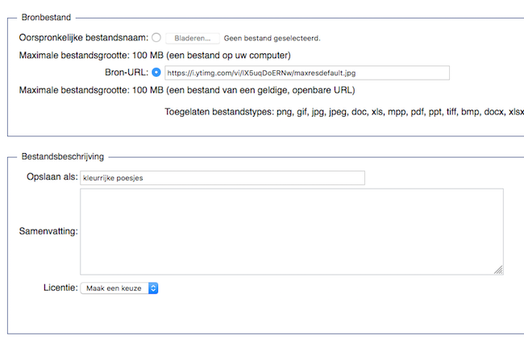

# Settings

All settings should be changes in the file `LocalSettings.php`. This file is in the root folder of the application.

## LocalSettings.php

Change permissions: `sudo chmod 600 LocalSettings.php`

## Change name and logo of website

In `LocalSettings.php`:

```php
$wgSitename = "KP TRACKS";
```

```php
$wgLogo = "$wgResourceBasePath/resources/assets/logo.svg"; # path to your image
```

## Enable upload

Source: [Manual:Configuring file uploads](https://www.mediawiki.org/wiki/Manual:Configuring_file_uploads)

### Enable file upload

- in `LocalSettings.php`: `$wgEnableUploads = true;`
- make de `images`-folder writable:
  - in our local instanc: `chmod 777 images`
  - in production we'll probably `chown` to the webserver group and `chmod 775 images`
  
### Enable upload by copy of URL

It's possible to upload files by copying a URL of the file. These files will be downloaded to the `images`-folder on your server.




Add following lines in `LocalSettings.php`:

```php
$wgGroupPermissions['autoconfirmed']['upload_by_url'] = true;
$wgAllowCopyUploads = true;
$wgCopyUploadsFromSpecialUpload = true;
```
  
### Configure file types
  
Default, only `.png`, `.gif`, `.jpg`, `.jpeg`, `.webp` can be uploaded. It's possible to add more file types via `LocalSettings.php`:

```php
$wgFileExtensions = array( 'png', 'gif', 'jpg', 'jpeg', 'doc','xls', 
  'pdf', 'ppt', 'tiff', 'bmp', 'docx', 'xlsx', 'pptx', 
  'tif', 'odt', 'ods', 'odp'
 );`
```

You can add or remove file types

### Enable use of images of Wikimedia Commons

InstantCommons is a feature which gives you immediate access to the millions of free (freely licensed) files in Wikimedia Commons.

Change following line in `LocalSettings.php`:

```php
# InstantCommons allows wiki to use images from https://commons.wikimedia.org
$wgUseInstantCommons = true;
```

Use images in your wiki text of Wikimedia Commons (example: [https://commons.wikimedia.org/wiki/File:Vooruit_Gent.jpg](https://commons.wikimedia.org/wiki/File:Vooruit_Gent.jpg)):

```wiki
[[Image:Vooruit_Gent.jpg]]
```

More information: [InstantCommons](https://www.mediawiki.org/wiki/InstantCommons).

## Rights Information

Source: [Category:Copyright variables](https://www.mediawiki.org/wiki/Category:Copyright_variables)

You can add rights information on every page. Choose the right license and icon and change this in the `LocalSettings.php`. These licesens are supported by default:

- CC0
- CC BY
- CC BY-SA
- CC BY-NC-SA
- Public Domain
- GNU Free Documentation License

```php
$wgRightsUrl = "https://creativecommons.org/licenses/by-sa/3.0/";
$wgRightsIcon = "$wgScriptPath/resources/assets/licenses/cc-by-sa.png";
```

It's also possible to create a page with your rights statement and to create a link in the footer to this page. This overrides the `$wgRightsUrl`.

```php
$wgRightsPage = ""; # Set to the title of a wiki page that describes your license/copyright
$wgRightsText = ""; # Text for the link of $wgRightsPage
```

We use the CC-licenses in our setup.

## Configure footer icons

Source: [Manual:$wgFooterIcons](https://www.mediawiki.org/wiki/Manual:$wgFooterIcons)

Default, the _powered by Mediawiki_ and license icon are shown in the footer. You can add new icons to the footer or remove the default ones.

Default setup:

```php
$wgFooterIcons = [
  "copyright" => [
    "copyright" => [], // placeholder for the built in copyright icon
  ],
  "poweredby" => [
    "mediawiki" => [
    // Defaults to point at
    // "$wgResourceBasePath/resources/assets/poweredby_mediawiki_88x31.png"
    // plus srcset for 1.5x, 2x resolution variants.
      "src" => null,
      "url" => "https://www.mediawiki.org/",
      "alt" => "Powered by MediaWiki",
      ]
    ],
 ];
```

It's possible to add your own logos. Default values of `width` and `height` are 88x31. It's also possible to change this and to set your own height and width.

```php
$wgFooterIcons = [
  "copyright" => [
    "copyright" => [], // placeholder for the built in copyright icon
  ],
  "poweredby" => [
    "meemoo" => [
      "src" => "$wgResourceBasePath/resources/assets/meemoologo.png",
      "url" => "https://packed.be",
      "alt" => "Powered by meemoo",
      "width" => "52"
   ],
    "mediawiki" => [
    // Defaults to point at
    // "$wgResourceBasePath/resources/assets/poweredby_mediawiki_88x31.png"
    // plus srcset for 1.5x, 2x resolution variants.
      "src" => null,
      "url" => "https://www.mediawiki.org/",
      "alt" => "Powered by MediaWiki",
      ]
    ],
 ];
```

## Visual editor

### Parsoid

