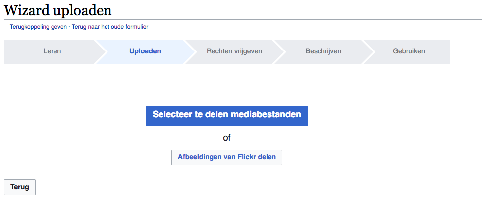

# Settings

All settings should be changes in the file `LocalSettings.php`. This file is in the root folder of the application.

## Contents

- [Settings](#settings)
  - [Contents](#contents)
  - [LocalSettings.php](#localsettingsphp)
  - [Change name and logo of website](#change-name-and-logo-of-website)
  - [File usage](#file-usage)
    - [Enable file upload](#enable-file-upload)
    - [Enable upload by copy of URL](#enable-upload-by-copy-of-url)
    - [Configure file types](#configure-file-types)
    - [Enable use of ImageMagick](#enable-use-of-imagemagick)
    - [Enable use of images of Wikimedia Commons](#enable-use-of-images-of-wikimedia-commons)
    - [Bulk uploads](#bulk-uploads)
  - [Rights Information](#rights-information)
  - [Configure footer icons](#configure-footer-icons)
  - [Custom namespaces](#custom-namespaces)
  - [Skins](#skins)
  - [Extensions](#extensions)
    - [Visual editor](#visual-editor)
    - [Parsoid](#parsoid)
    - [UploadWizard](#uploadwizard)

## LocalSettings.php

Change permissions: `sudo chmod 600 LocalSettings.php`

## Change name and logo of website

In `LocalSettings.php`:

```php
$wgSitename = "KP TRACKS";
```

```php
$wgLogo = "$wgResourceBasePath/resources/assets/logo.svg"; # path to your image
```

## File usage

There are a lot of configurations, concerning files:

- more information on configuration for images and certain file types, go to the [Manual:Configuration settings about images](https://www.mediawiki.org/wiki/Manual:Configuration_settings#Images) on Mediawiki.
- more information on [configuring file uploads](https://www.mediawiki.org/wiki/Manual:Configuring_file_uploads)

### Enable file upload

- in `LocalSettings.php`: `$wgEnableUploads = true;`
- make de `images`-folder writable:
  - in our local instanc: `chmod 777 images`
  - in production we'll probably `chown` to the webserver group and `chmod 775 images`
  
### Enable upload by copy of URL

It's possible to upload files by copying a URL of the file. These files will be downloaded to the `images`-folder on your server.


Add following lines in `LocalSettings.php`:

```php
$wgGroupPermissions['autoconfirmed']['upload_by_url'] = true;
$wgAllowCopyUploads = true;
$wgCopyUploadsFromSpecialUpload = true;
```
  
### Configure file types
  
Default, only `.png`, `.gif`, `.jpg`, `.jpeg`, `.webp` can be uploaded. It's possible to add more file types via `LocalSettings.php`:

```php
$wgFileExtensions = array( 'png', 'gif', 'jpg', 'jpeg', 'doc','xls','pdf', 'ppt', 'docx', 'xlsx', 'pptx', 'odt', 'ods', 'odp', 'webm', 'mp4', 'ogg'
 );`
```

You can add or remove file types. In the above line, only file formats of image and video that are supported by browsers are enabled. You can also decide to allow TIFF (which isn't supported by browsers) files and have them converted in thumbnals by Mediawiki itself. They can be converted in JPEG or PNG. Add one of following lines in `LocalSettings.php`:

```php
// PNG is lossless, but inefficient for photos
$wgTiffThumbnailType = array( 'png', 'image/png' );

// JPEG is good for photos, but has no transparency support. Bad for diagrams.
$wgTiffThumbnailType = array( 'jpg', 'image/jpeg' );
```

### Enable use of ImageMagick

MediaWiki can be configured to use ImageMagick to do dynamic resizing and thumbnailing of images. ImageMagick is recommended since it produces better quality thumbnails.

Uncomment following lines in the `LocalSettings.php`:

```php
$wgUseImageMagick = true;
$wgImageMagickConvertCommand = '/usr/bin/convert'; # for linux
```

### Enable use of images of Wikimedia Commons

InstantCommons is a feature which gives you immediate access to the millions of free (freely licensed) files in Wikimedia Commons.

Change following line in `LocalSettings.php`:

```php
# InstantCommons allows wiki to use images from https://commons.wikimedia.org
$wgUseInstantCommons = true;
```

Use images in your wiki text of Wikimedia Commons (example: [https://commons.wikimedia.org/wiki/File:Vooruit_Gent.jpg](https://commons.wikimedia.org/wiki/File:Vooruit_Gent.jpg)):

```wiki
[[Image:Vooruit_Gent.jpg]]
```

More information: [InstantCommons](https://www.mediawiki.org/wiki/InstantCommons).

### Bulk uploads

Bulk uploads is possible via the UploadWizard-extension (see [Extensions](Extensions.md)).

__Requirements:__

- [Uploads are enabled](#enable-file-upload)
- [Use of ImageMagick is enabled](#enable-use-of-imagemagick)
- [Use of InstantCommons is enabled](#enable-use-of-images-of-wikimedia-commons)




A wizard for choosing a license is included.


You can add descriptions in multiple languages (needs to be configured in your `LocalSettings.php` for this extension)


EXIF-metadata can also be uploaded


## Rights Information

Source: [Category:Copyright variables](https://www.mediawiki.org/wiki/Category:Copyright_variables)

You can add rights information on every page. Choose the right license and icon and change this in the `LocalSettings.php`. These licesens are supported by default:

- CC0
- CC BY
- CC BY-SA
- CC BY-NC-SA
- Public Domain
- GNU Free Documentation License

```php
$wgRightsUrl = "https://creativecommons.org/licenses/by-sa/3.0/";
$wgRightsIcon = "$wgScriptPath/resources/assets/licenses/cc-by-sa.png";
```

It's also possible to create a page with your rights statement and to create a link in the footer to this page. This overrides the `$wgRightsUrl`.

```php
$wgRightsPage = ""; # Set to the title of a wiki page that describes your license/copyright
$wgRightsText = ""; # Text for the link of $wgRightsPage
```

We use the CC-licenses in our setup.

## Configure footer icons

Source: [Manual:$wgFooterIcons](https://www.mediawiki.org/wiki/Manual:$wgFooterIcons)

Default, the _powered by Mediawiki_ and license icon are shown in the footer. You can add new icons to the footer or remove the default ones.

Default setup:

```php
$wgFooterIcons = [
  "copyright" => [
    "copyright" => [], // placeholder for the built in copyright icon
  ],
  "poweredby" => [
    "mediawiki" => [
    // Defaults to point at
    // "$wgResourceBasePath/resources/assets/poweredby_mediawiki_88x31.png"
    // plus srcset for 1.5x, 2x resolution variants.
      "src" => null,
      "url" => "https://www.mediawiki.org/",
      "alt" => "Powered by MediaWiki",
      ]
    ],
 ];
```

It's possible to add your own logos. Default values of `width` and `height` are 88x31. It's also possible to change this and to set your own height and width.

```php
$wgFooterIcons = [
  "copyright" => [
    "copyright" => [], // placeholder for the built in copyright icon
  ],
  "poweredby" => [
    "meemoo" => [
      "src" => "$wgResourceBasePath/resources/assets/meemoologo.png",
      "url" => "https://packed.be",
      "alt" => "Powered by meemoo",
      "width" => "52"
   ],
    "mediawiki" => [
    // Defaults to point at
    // "$wgResourceBasePath/resources/assets/poweredby_mediawiki_88x31.png"
    // plus srcset for 1.5x, 2x resolution variants.
      "src" => null,
      "url" => "https://www.mediawiki.org/",
      "alt" => "Powered by MediaWiki",
      ]
    ],
 ];
```

## Custom namespaces

It's possible to add custom namespaces to structure the wiki, e.g. _Pilootprojecten_ to collect all the pilots of TRACKS, or _Organisaties_ for all the TRACKS-organisations.

You can add this feature in the `LocalSettings.php`

First, you'll need to define the namespace and its talk page by giving it an id and a number:

```php
define("NS_PILOOTPROJECT", 20);
define("NS_PILOOTPROJECT_TALK", 21);
```

Next, give a name to the namespaces:

```php
$wgExtraNamespaces[NS_PILOOTPROJECT] = "Pilootproject";
$wgExtraNamespaces[NS_PILOOTPROJECT_TALK] = "Pilootproject_talk";
```

## Skins

To add a skin, go to the `skins` folder in your mediawiki installation folder: `cd skins`; then download the code of the skin on the Mediawiki website ([All skins](https://www.mediawiki.org/wiki/Category:All_skins)).

Activate the skin by adjusting some variables in the `LocalSettings.php`:

```php
## Default skin: you can change the default skin. Use the internal symbolic
## names, ie 'vector', 'monobook':
$wgDefaultSkin = "vector";

# Enabled skins.
wfLoadSkin( 'Vector' );
```

## Extensions

To add an extension, go to the `extensions` folder in your mediawiki installation folder: `cd extensions`; then download the code of the extension on the Mediawiki website ([All extensions](https://www.mediawiki.org/wiki/Category:All_extensions)).

You then must activate the extension in the `LocalSettings.php`, e.g.:

```php
## WikiEditor
wfLoadExtension( 'WikiEditor' );
```

For more information about the extensions used in our setup, go to the [Extensions page](Extensions.md)

### Visual editor

Needs to be enabled for custom namespaces in the `LocalSettings.php`.

```php
$wgVisualEditorAvailableNamespaces = [
  "Pilootproject" => true,
  "Topic" => true,
  "Organisatie" => true
];
```

VisualEditor can be set as the default editor:

```php
$wgDefaultUserOptions['visualeditor-enable'] = 1;
```

### Parsoid

[Parsoid](https://www.mediawiki.org/wiki/Parsoid) needs to be installed on the server. Starting from June 2020, it will be integrated by default in the Mediawiki code.

Connection with Parsoid needs to be configured in the `LocalSettings.php`.

```php
$wgVirtualRestConfig['modules']['parsoid'] = array(
  // URL to the Parsoid instance
  // Use port 8142 if you use the Debian package
  'url' => 'https://localhost:8000',
  // Parsoid "domain", see below (optional)
  'domain' => 'localhost',
  // Parsoid "prefix", see below (optional)
  'prefix' => 'localhost'
);
```

### UploadWizard

Some custom changes can be made in the `LocalSettings.php`:

```php
$wgUploadWizardConfig = array(
	'debug' => false,
	'autoAdd' => array(
	 	'wikitext' => array(), # autogenerated wiki text can defined here
	 	'categories' => array(), # add it to a certain category
		), // Should be localised to the language of your wiki instance
	'feedbackPage' => 'Feedback about UploadWizard',
	'altUploadForm' => 'Special:Upload', # user can choose to go to the regular upload form
	'fallbackToAltUploadForm' => false,
	'feedbackLink' => false, // Disable the link for feedback (default: points to Commons)
	'alternativeUploadToolsPage' => false, // Disable the link to alternative upload tools (default: points to Commons)
	'enableFormData' => true, // Enable FileAPI uploads be used on supported browsers
	'enableMultipleFiles' => true,
	'enableMultiFileSelect' => false,
	'uwLanguages' => array(
		'nl' => 'Nederlands',
		'en' => 'English'
		), // Selectable languages for file descriptions - defaults to 'en'
	'tutorial' => array(
	 	'skip' => true
		), // Skip the tutorial
	'maxUploads' => 50, // Number of uploads with one form - defaults to 50
	'fileExtensions' => $wgFileExtensions // omitting this may cause errors
  );
```

You can also use it as the default upload tool. Then add the following in your `LocalSettings.php`

```php
$wgUploadNavigationUrl = '/wiki/Special:UploadWizard'; # where /wiki/ is the correct path for your wiki
```

You can also decide to make a connection with Flick: [Extension:UploadWizard - Enabling Flickr uploads](https://www.mediawiki.org/wiki/Extension:UploadWizard#Enabling_Flickr_uploads)

Read more in [Bulk uploads](#bulk-uploads) about this feature.
